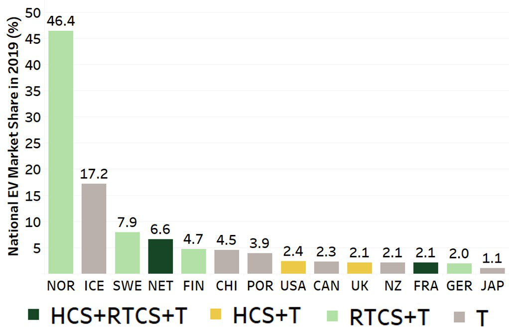

<br />
<p align="center">

  <h1 align="center">EV Load Open Data</h1>

  <p align="center">
    Gathering and exploring electric vehicle charging sessions open data.
    <br />
  </p>
</p>


<!-- TABLE OF CONTENTS -->
<details open="open">
  <summary><h2 style="display: inline-block">Table of Contents</h2></summary>
  <ol>
    <li><a href="#about-the-project">About The Project</a></li>
	<li><a href="#getting-started">Getting Started</a></li>
	<ul>
	<li><a href="#data">Data</a></li>
	<li><a href="#prerequisites">Prerequisites</a></li>
	</ul>
    <li><a href="#key-visual">Key visual</a></li>    
    <li><a href="#author">Author</a></li>
    <li><a href="#license">License</a></li>
  </ol>
</details>

## About The Project

Numerous papers highlight the lack of charging station data available in order to build models that are consistent with reality. 
In this context, the purpose of this project to gather open EV charging datasets available in order to foster reproducible research in the field.
In particulare we explores electric vehicle charging session data from different open data sources which can be used for research purposes. 

A thorough walkthrough of the datasets as well as a review of EV load models are proposed in the following publication:

* **Yvenn Amara-Ouali, Yannig Goude, Pascal Massart, Jean-Michel Poggi, Hui Yan** - *A Review of Electric Vehicle Load Open Data and Models* (2021) - [Energies](https://doi.org/10.3390/en14082233)

Keywords: electric vehicles, charging point, load modelling, smart charging, open data, statistical modelling


## Getting Started

This repository contains the most relevant data and codes produced for the experiments detailed in our paper. 

[1. Input Data](./1.%20Input%20Data) contains the raw data we found in our research. Feel free to contact if you know of any additional open data sources which may not be present here.
[2. Scripts](./2.%20Scripts) gathers the R scripts used to preprocess and analyse the data.
[3. Outputs](./3.%20Outputs) assembles the csv outputs generated after the data preprocessing


### Data

8 datasets covering all common charging behaviours are explored in this project:
* Public
	* Dundee (UK)
	* Perth & Kinross (UK)
	* Palo Alto (California, USA)
	* Boulder (Colorado, USA)
	* Paris (France)
* Residential
	* Electric Chargepoint Analysis (Domestics UK)
* Workplace
	* SAP Labs (France)
	* ACN (California, USA)
	
The **Electric Chargepoint Analysis** dataset is too heavy for GitHub and is not directly available on this repository. 
Please refer to this [pdf file](./1.%20Input%20Data/6.%20Chargepoint%20Analysis) in order to retrieve the dataset and put it in the same folder for the code to run without errors. 

### Prerequisites

Here are the various R packages that can be directly installed in Rstudio as follows:

```
install.packages("tidyverse")
install.packages("lubridate")
install.packages("stringr")
install.packages("rjson")
install.packages("fitdistrplus")
````

## Key visual

- National EV market share per country coloured by data availability


## Author
* **Yvenn Amara-Ouali** - (https://www.yvenn-amara.com)

## License

This project is licensed under the GNU GPLv3 License - see the [LICENSE.md](LICENSE.md) file for details
